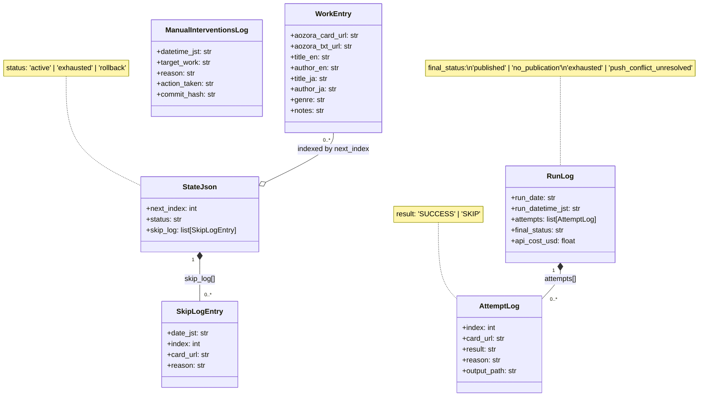
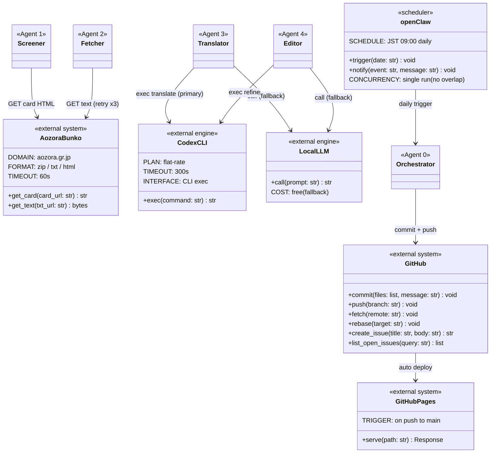

# CLASS.md — Aozora Daily Translations

クラス図（Mermaid記法）。USECASE.md・SEQUENCE.md・SPEC.md を設計根拠とする。

---

## 1. 全体クラス図

```mermaid
classDiagram
    %% ===== Interfaces =====
    class LLMEngine {
        <<interface>>
        +translate(text_ja: str, metadata: WorkEntry) TranslationResult
        +refine(translation_en: str, genre: str) str
    }

    %% ===== LLM Implementations =====
    class CodexCLI {
        +timeout_sec: int = 300
        +translate(text_ja: str, metadata: WorkEntry) TranslationResult
        +refine(translation_en: str, genre: str) str
        -exec(command: str) str
    }

    class LocalLLM {
        +translate(text_ja: str, metadata: WorkEntry) TranslationResult
        +refine(translation_en: str, genre: str) str
    }

    LLMEngine <|.. CodexCLI : implements
    LLMEngine <|.. LocalLLM : implements

    %% ===== Data Models =====
    class WorkEntry {
        +aozora_card_url: str
        +aozora_txt_url: str
        +title_en: str
        +author_en: str
        +title_ja: str
        +author_ja: str
        +genre: str
        +notes: str
    }

    class StateJson {
        +next_index: int
        +status: str
        +skip_log: list[SkipLogEntry]
        +load(path: str) StateJson$
        +save(path: str) void
        +is_exhausted() bool
        +set_exhausted() void
    }

    class SkipLogEntry {
        +date_jst: str
        +index: int
        +card_url: str
        +reason: str
    }

    class RunLog {
        +run_date: str
        +run_datetime_jst: str
        +attempts: list[AttemptLog]
        +final_status: str
        +api_cost_usd: float
        +save(path: str) void
    }

    class AttemptLog {
        +index: int
        +card_url: str
        +result: str
        +reason: str
        +output_path: str
    }

    class FetchResult {
        +raw_text_ja: str
        +clean_text_ja: str
        +P_ja: int
        +C_ja: int
    }

    class TranslationResult {
        +translation_en: str
        +introduction_en: str
        +source: str
    }

    class ScreenResult {
        +status: str
        +reason: str
    }

    class QAResult {
        +status: str
        +reason: str
        +P_en: int
        +W_en: int
        +R: float
    }

    class QAGateConfig {
        +max_artifact_count: int = 3
        +short_r_min: float = 0.28
        +short_r_max: float = 0.95
        +poem_r_min: float = 0.18
        +poem_r_max: float = 1.20
        +forbidden_phrases: list[str]
    }

    class PublishResult {
        +work_page_path: str
        +index_paths: list[str]
        +seo_paths: list[str]
    }

    StateJson "1" *-- "0..*" SkipLogEntry : contains
    RunLog "1" *-- "0..*" AttemptLog : contains

    %% ===== Agents =====
    class Orchestrator {
        +works: list[WorkEntry]
        +state: StateJson
        +max_attempts: int = 3
        +run(date: str) void
        -select_candidate(index: int) WorkEntry
        -handle_skip(index: int, reason: str) void
        -update_state(next_index: int) void
        -commit_and_push(files: list[str]) void
        -check_and_create_exhausted_issue() void
    }

    class Screener {
        +screen(candidate: WorkEntry) ScreenResult
        -check_public_domain(card_html: str) bool
        -detect_translation_work(card_html: str) bool
        -check_annotation_heavy(card_html: str) bool
        -check_us_distribution_risk(card_html: str) bool
    }

    class Fetcher {
        +max_retries: int = 3
        +timeout_sec: int = 60
        +fetch(txt_url: str) FetchResult
        -download_with_retry(url: str) bytes
        -extract_text(data: bytes) str
        -remove_ruby(text: str) str
        -remove_annotations(text: str) str
        -count_paragraphs(text: str) int
    }

    class Translator {
        +primary_engine: LLMEngine
        +fallback_engine: LLMEngine
        +timeout_sec: int = 300
        +translate(clean_text_ja: str, metadata: WorkEntry) TranslationResult
    }

    class Editor {
        +engine: LLMEngine
        +edit(translation_en: str, genre: str) str
    }

    class QAAuditor {
        +config: QAGateConfig
        +audit(translation_en: str, fetch_result: FetchResult) QAResult
        -check_paragraph_count(P_en: int, P_ja: int) bool
        -check_length_ratio(W_en: int, C_ja: int, genre: str) bool
        -check_artifacts(text: str) bool
        -check_boilerplate(text: str) bool
    }

    class Publisher {
        +work_page_gen: WorkPageGenerator
        +index_gen: IndexArchiveGenerator
        +seo_gen: SitemapSEOGenerator
        +publish(metadata: WorkEntry, translation: TranslationResult, qa: QAResult) PublishResult
    }

    class WorkPageGenerator {
        +generate(metadata: WorkEntry, translation: TranslationResult, intro: str) str
        -generate_slug(title_en: str, date: str) str
        -apply_template(data: dict) str
        -xss_escape(text: str) str
        -check_slug_collision(slug: str) str
    }

    class IndexArchiveGenerator {
        +update_index(work_metadata: WorkEntry, date: str) list[str]
        -update_home_page(work: WorkEntry) void
        -update_author_page(author_slug: str, work: WorkEntry) void
        -generate_author_slug(author_en: str) str
    }

    class SitemapSEOGenerator {
        +update_seo(work_url: str) list[str]
        -update_sitemap(url: str) void
        -update_robots_txt() void
    }

    QAAuditor --> QAGateConfig : uses
    Publisher "1" *-- "1" WorkPageGenerator : contains
    Publisher "1" *-- "1" IndexArchiveGenerator : contains
    Publisher "1" *-- "1" SitemapSEOGenerator : contains

    %% ===== Orchestrator の依存 =====
    Orchestrator "1" --> "1" StateJson : reads/writes
    Orchestrator "1" --> "0..*" WorkEntry : selects from
    Orchestrator "1" --> "1" RunLog : produces
    Orchestrator --> Screener : delegates
    Orchestrator --> Fetcher : delegates
    Orchestrator --> Translator : delegates
    Orchestrator --> Editor : delegates
    Orchestrator --> QAAuditor : delegates
    Orchestrator --> Publisher : delegates

    %% ===== Agent の入出力型 =====
    Screener ..> ScreenResult : produces
    Fetcher ..> FetchResult : produces
    Translator --> LLMEngine : primary + fallback
    Translator ..> TranslationResult : produces
    Editor --> LLMEngine : uses
    QAAuditor ..> QAResult : produces
    Publisher ..> PublishResult : produces
```

---

## 2. データモデル詳細図

`works.json` / `state.json` / `DATA/logs/` の永続化スキーマとその関係を示す。

---

## 3. エージェント責務図

各エージェントの入出力インタフェースと責務境界を示す。

```mermaid
classDiagram
    class Agent0_Orchestrator {
        <<Agent 0>>
        INPUT: works.json, state.json, date
        OUTPUT: site files, state.json, RunLog
        +run(date: str) void
        +select_candidate() WorkEntry
        +retry_loop(max=3) void
        +commit_and_push() void
    }

    class Agent1_Screener {
        <<Agent 1>>
        INPUT: WorkEntry (card_url)
        OUTPUT: ScreenResult
        +screen(candidate: WorkEntry) ScreenResult
        RULE: public domain check
        RULE: translation-work detection
        RULE: annotation-heavy check
        RULE: US distribution risk
    }

    class Agent2_Fetcher {
        <<Agent 2>>
        INPUT: aozora_txt_url
        OUTPUT: FetchResult (clean_text_ja, P_ja, C_ja)
        +fetch(url: str) FetchResult
        RETRY: max 3 times (backoff 1s/2s/4s)
        NORMALIZE: remove ruby, annotations
    }

    class Agent3_Translator {
        <<Agent 3>>
        INPUT: clean_text_ja, WorkEntry
        OUTPUT: TranslationResult (translation_en, introduction_en)
        +translate(text: str, meta: WorkEntry) TranslationResult
        ENGINE: CodexCLI (primary) → LocalLLM (fallback)
        INTRO: 100-150 words
    }

    class Agent4_Editor {
        <<Agent 4>>
        INPUT: translation_en, genre
        OUTPUT: edited_translation_en
        +edit(text: str, genre: str) str
        ENGINE: CodexCLI / LocalLLM
        PRESERVE: paragraph structure, poem rhythm
    }

    class Agent5_QAAuditor {
        <<Agent 5>>
        INPUT: edited_translation_en, FetchResult
        OUTPUT: QAResult (PASS/FAIL + metrics)
        +audit(text: str, metrics: FetchResult) QAResult
        GATE: paragraph count mismatch
        GATE: length ratio R = W_en / C_ja
        GATE: artifact count <= 3
        GATE: forbidden boilerplate
    }

    class Agent6A_WorkPageGen {
        <<Agent 6A>>
        INPUT: WorkEntry, TranslationResult, date
        OUTPUT: /works/YYYY-MM-DD-slug/index.html
        +generate(meta, translation, intro) str
        SECURITY: XSS escape, CSP meta
        SLUG: title_en → kebab-case (max 50 chars)
    }

    class Agent6B_IndexGen {
        <<Agent 6B>>
        INPUT: WorkEntry, date
        OUTPUT: /index.html, /authors/slug/index.html
        +update_index(meta, date) list[str]
        POLICY: append-only archive
    }

    class Agent6C_SitemapGen {
        <<Agent 6C>>
        INPUT: work_url
        OUTPUT: /sitemap.xml, /robots.txt
        +update_seo(url: str) list[str]
        CANONICAL: base_url + work path
    }

    Agent0_Orchestrator --> Agent1_Screener : 1. screen
    Agent0_Orchestrator --> Agent2_Fetcher : 2. fetch
    Agent0_Orchestrator --> Agent3_Translator : 3. translate
    Agent0_Orchestrator --> Agent4_Editor : 4. edit
    Agent0_Orchestrator --> Agent5_QAAuditor : 5. audit
    Agent0_Orchestrator --> Agent6A_WorkPageGen : 6A. generate page
    Agent0_Orchestrator --> Agent6B_IndexGen : 6B. update index
    Agent0_Orchestrator --> Agent6C_SitemapGen : 6C. update SEO
```

---

## 4. 外部システム連携図

エージェントと外部サービスのインタフェースを示す。

---

## 5. クラス関係サマリ

| 関係 | 説明 |
|------|------|
| `Orchestrator` → `StateJson` | 読み込み・書き込み（next_index 更新、status 変更） |
| `Orchestrator` → `WorkEntry[]` | next_index で選択 |
| `Orchestrator` → 各Agent | 順次委譲（Screen → Fetch → Trans → Edit → QA → Pub） |
| `StateJson` *-- `SkipLogEntry` | コンポジション（スキップ履歴を内包） |
| `RunLog` *-- `AttemptLog` | コンポジション（試行ログを内包） |
| `Publisher` *-- `6A/6B/6C` | コンポジション（サブエージェントを統括） |
| `LLMEngine` ← `CodexCLI` / `LocalLLM` | インタフェース実装（primary / fallback） |
| `Translator` / `Editor` → `LLMEngine` | ポリモーフィズムで切り替え |
| `QAAuditor` → `QAGateConfig` | ゲート閾値を外部設定として保持 |
| `Orchestrator` → `GitHub` | commit + push（全成果物を同一コミット） |
