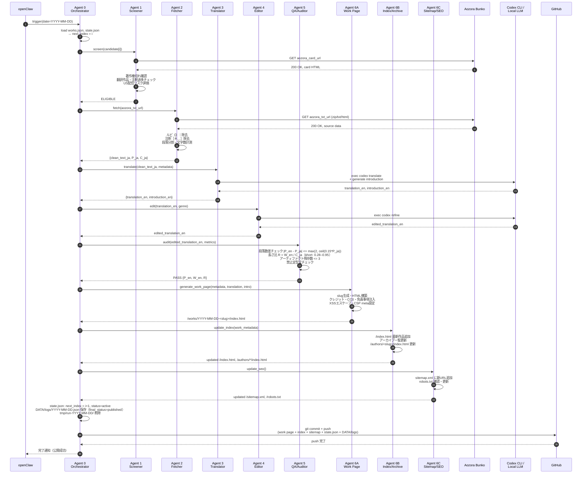
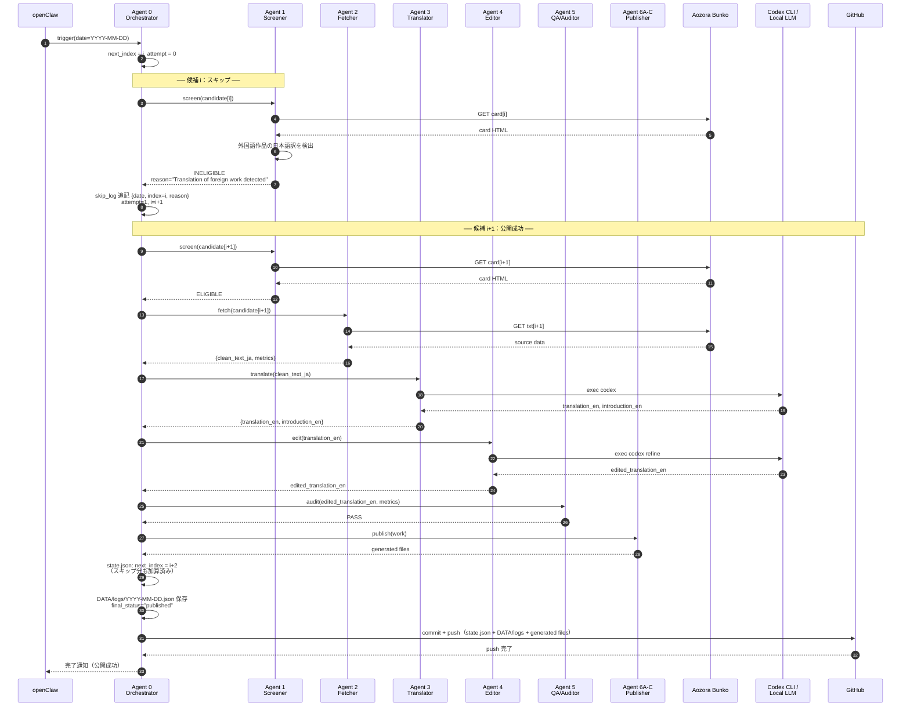
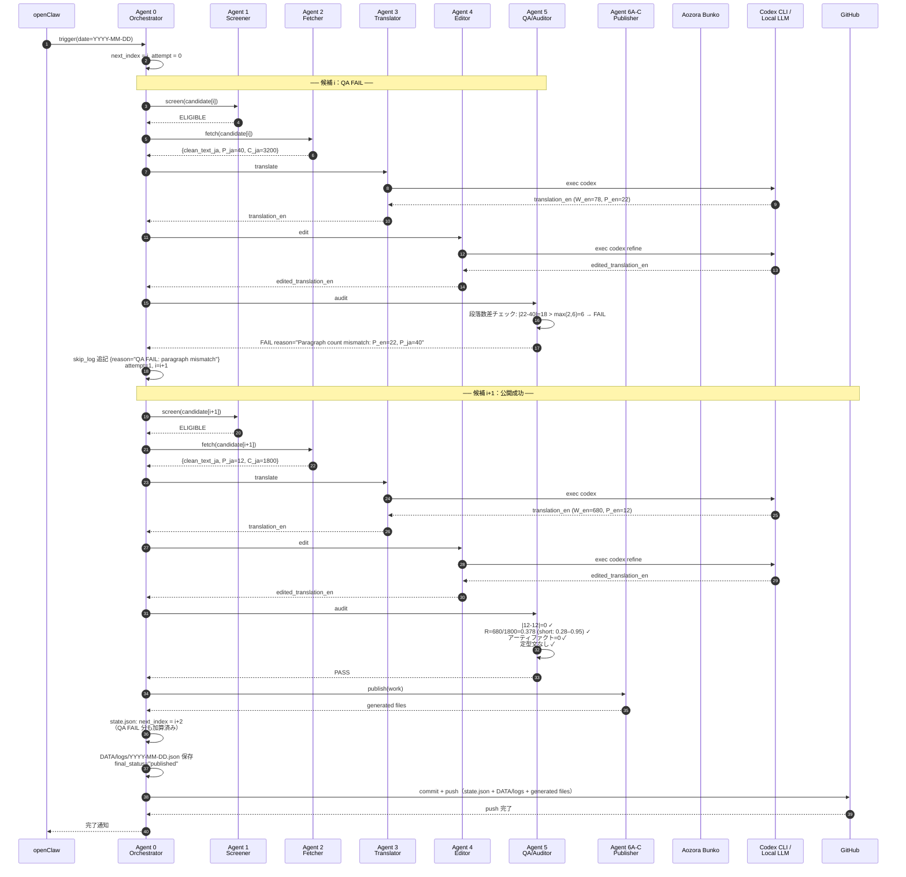
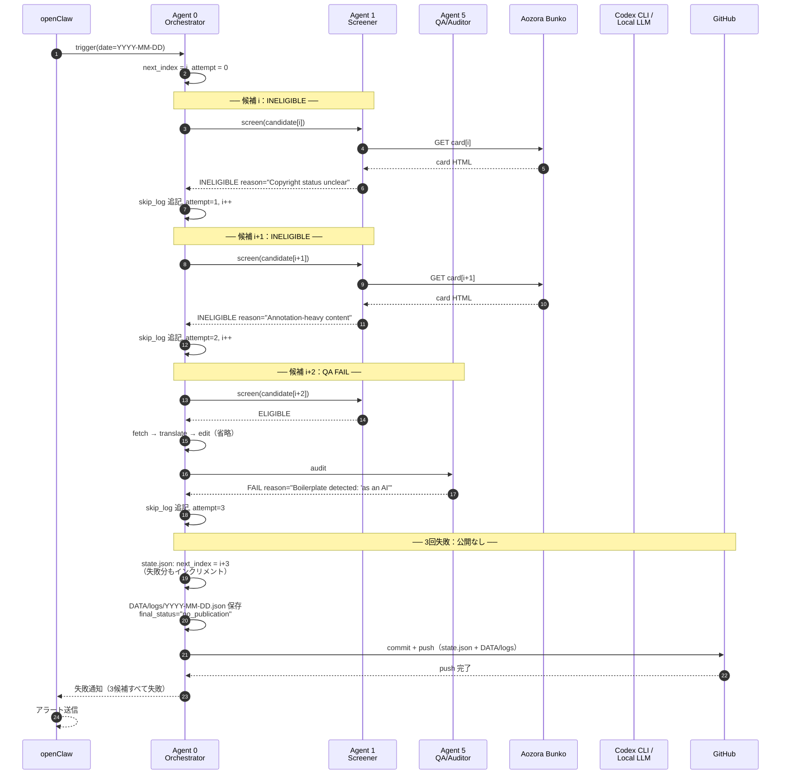
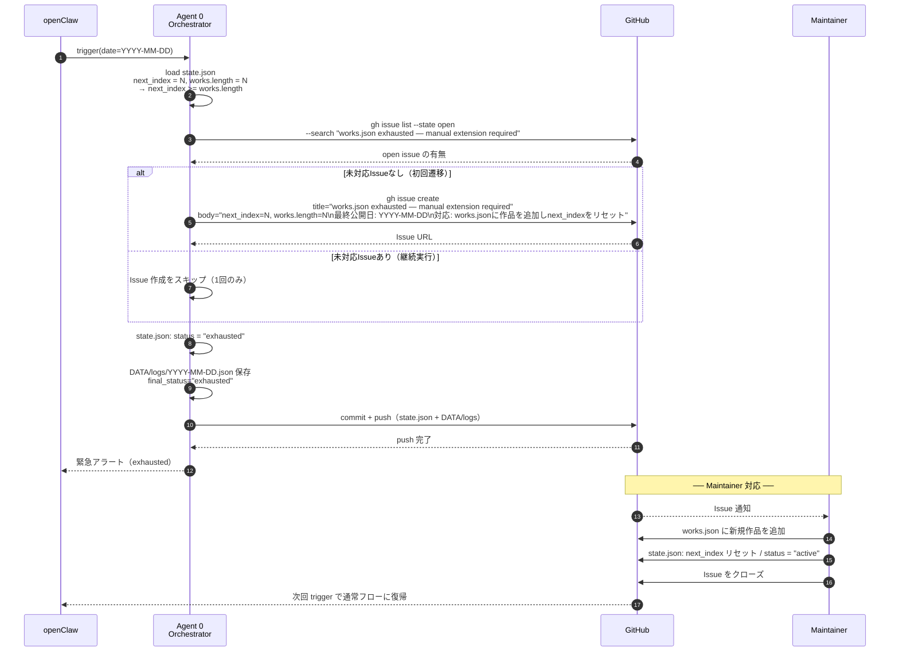
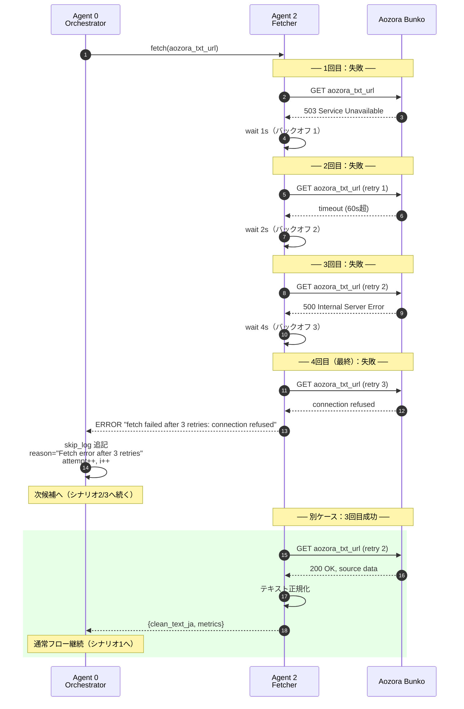
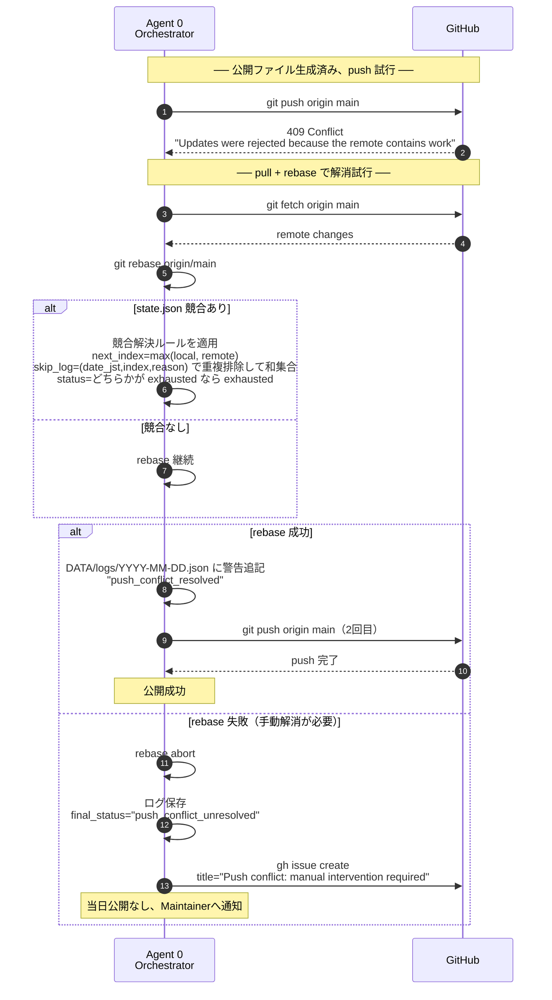
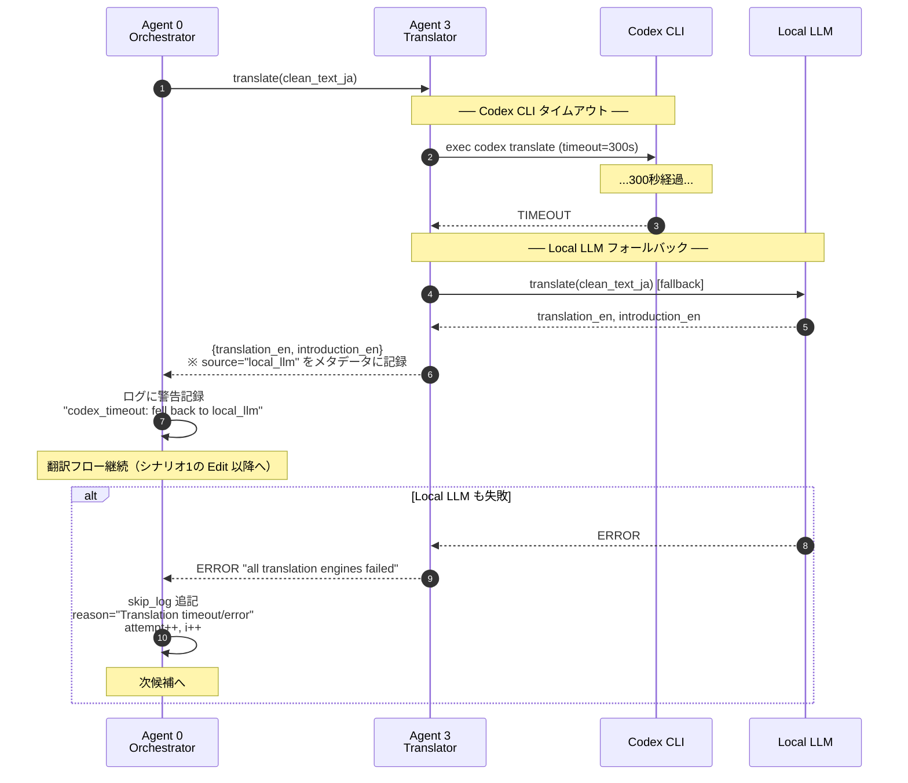
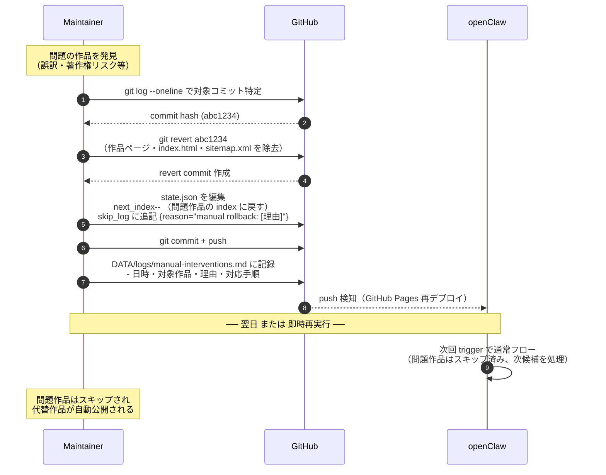
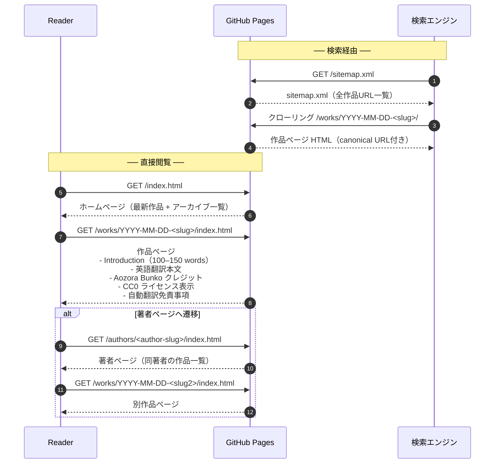

# SEQUENCE.md — Aozora Daily Translations

ユースケース（USECASE.md）を元にしたシーケンス図集。
各シナリオを網羅し、正常系・異常系・運用系に分類する。

---

## シナリオ一覧

| # | シナリオ | 分類 |
|---|----------|------|
| 1 | 日次ワークフロー 正常系（初回候補で公開成功） | 正常系 |
| 2 | スキップ1回 → 次候補で公開成功 | 準正常系 |
| 3 | QA失敗 → リトライで公開成功 | 準正常系 |
| 4 | 3候補すべて失敗（当日公開なし） | 異常系 |
| 5 | works.json 枯渇（exhausted） | 異常系 |
| 6 | Aozora Bunko 取得エラー（リトライ・指数バックオフ） | 異常系 |
| 7 | GitHub push エラー（コンフリクト） | 異常系 |
| 8 | 翻訳タイムアウト | 異常系 |
| 9 | Maintainer によるロールバック | 運用系 |
| 10 | Reader による作品閲覧 | 正常系 |

---

## 1. 日次ワークフロー 正常系

初回候補がスクリーニング・翻訳・QA をすべて通過し、公開まで完了するシナリオ。

---

## 2. スキップ1回 → 次候補で公開成功

候補 i が不適格（翻訳作品検出）でスキップされ、候補 i+1 が正常公開されるシナリオ。

---

## 3. QA失敗 → リトライで公開成功

候補 i の翻訳が品質ゲートで FAIL し、候補 i+1 で PASS して公開されるシナリオ。

---

## 4. 3候補すべて失敗（当日公開なし）

3候補すべてが INELIGIBLE または QA FAIL となり、当日は公開されないシナリオ。

---

## 5. works.json 枯渇（exhausted）

`next_index` が `works.length` に達した際、未対応 Issue が無い場合のみ GitHub Issue を1回作成するシナリオ。

---

## 6. Aozora Bunko 取得エラー（リトライ・指数バックオフ）

テキスト取得が断続的に失敗し、指数バックオフで3回リトライするシナリオ。

---

## 7. GitHub push エラー（コンフリクト）

push 時にコンフリクトが発生し、pull-rebase を1回試み、`state.json` を決定的ルールで解消するシナリオ。

---

## 8. 翻訳タイムアウト

Codex CLI 呼び出しが 300秒 (5分) を超過し、ローカルLLM フォールバックを試みるシナリオ。

---

## 9. Maintainer によるロールバック

公開済み作品に問題が発覚し、手動でロールバックを実施するシナリオ。

---

## 10. Reader による作品閲覧

読者が GitHub Pages を通じて翻訳作品を閲覧するシナリオ。

