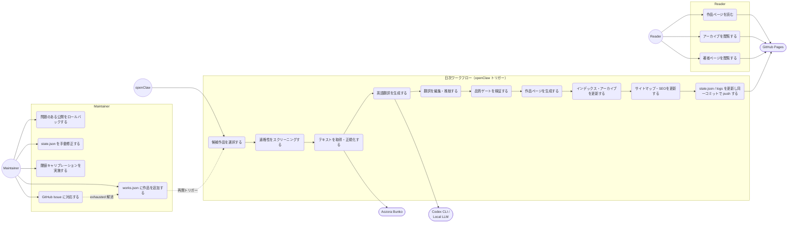
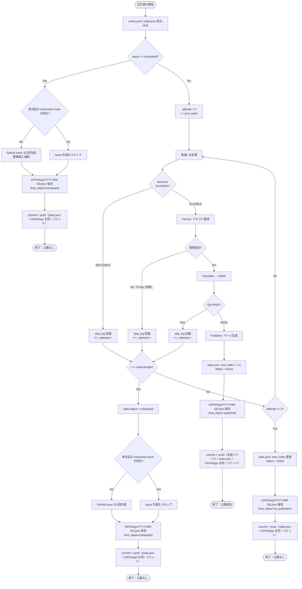
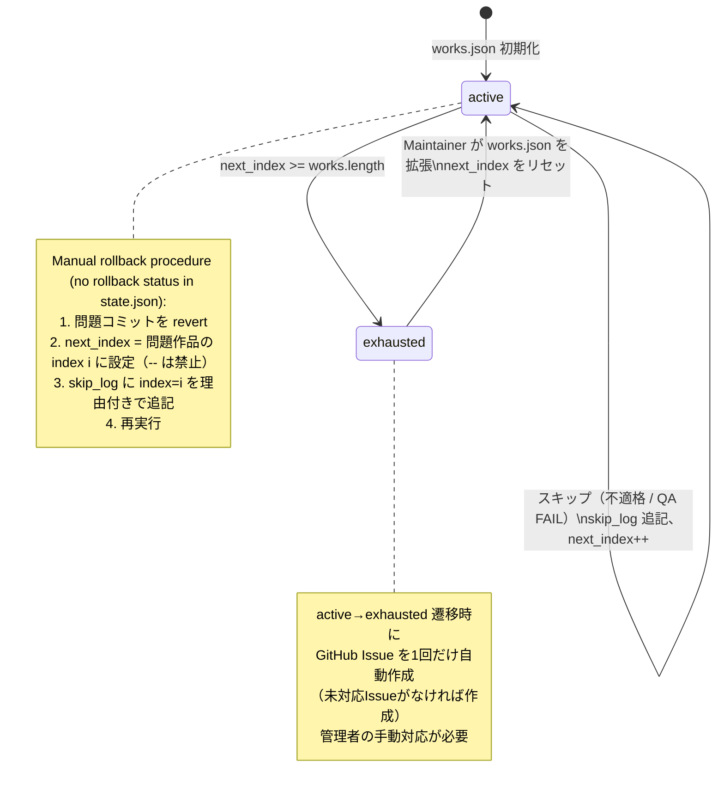
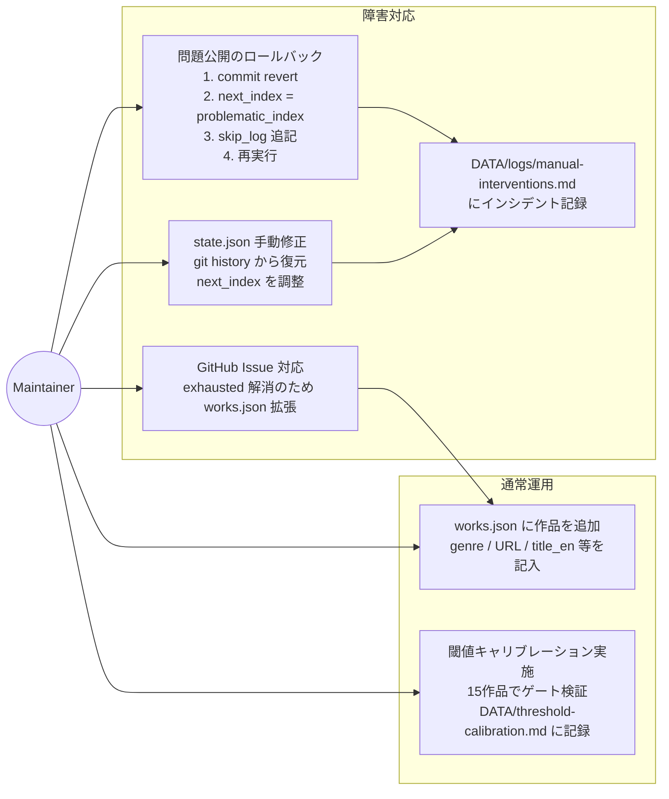
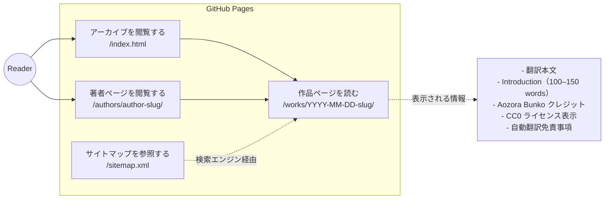

# USECASE.md — Aozora Daily Translations

ユースケース図（Mermaid記法）。SPEC.md を設計根拠とする。

---

## 1. アクター定義

| アクター | 種別 | 説明 |
|----------|------|------|
| Reader | 主アクター | 翻訳済み作品を閲覧する一般ユーザー |
| Maintainer | 主アクター | `works.json` の管理・障害対応を行う運営者 |
| openClaw | 主アクター（システム） | 日次ワークフローをトリガーするスケジューラー |
| Aozora Bunko | 外部システム | 日本語原文テキストの配信元 |
| Codex CLI / Local LLM | 外部システム | 翻訳・Introduction生成エンジン |
| GitHub Pages | 外部システム | 静的サイトのホスティング |

---

## 2. ユースケース全体図



---

## 3. 日次ワークフロー シーケンス図

```mermaid
sequenceDiagram
    autonumber
    participant OC as openClaw
    participant Orch as Agent 0<br/>Orchestrator
    participant Screen as Agent 1<br/>Screener
    participant Fetch as Agent 2<br/>Fetcher
    participant Trans as Agent 3<br/>Translator
    participant Edit as Agent 4<br/>Editor
    participant QA as Agent 5<br/>QA/Auditor
    participant Pub as Agent 6A-C<br/>Publisher
    participant AZ as Aozora Bunko
    participant LLM as Codex CLI /<br/>Local LLM
    participant GH as GitHub

    OC->>Orch: 日次トリガー（JST 09:00）
    Orch->>Orch: works.json / state.json 読み込み<br/>next_index を取得

    loop 最大 3 候補まで retry
        Orch->>Screen: candidate (index i) を渡す
        Screen->>AZ: Aozora カードを取得
        AZ-->>Screen: カード HTML

        alt 不適格（翻訳作品 / 権利不明 / 注釈過多）
            Screen-->>Orch: INELIGIBLE + reason
            Orch->>Orch: skip_log に記録、i+1 へ
        else 適格
            Screen-->>Orch: ELIGIBLE

            Orch->>Fetch: テキスト取得を指示
            Fetch->>AZ: zip / txt / html を取得（最大 3 retry）
            AZ-->>Fetch: 原文データ
            Fetch->>Fetch: ルビ・注釈除去、clean_text_ja 生成
            Fetch-->>Orch: clean_text_ja + metrics

            Orch->>Trans: clean_text_ja を渡す
            Trans->>LLM: 翻訳 + Introduction 生成（exec）
            LLM-->>Trans: translation_en + introduction_en
            Trans-->>Orch: translation_en, introduction_en

            Orch->>Edit: translation_en を渡す
            Edit->>LLM: 英語流暢性改善
            LLM-->>Edit: edited_translation_en
            Edit-->>Orch: edited_translation_en

            Orch->>QA: 全成果物を渡す
            QA->>QA: Format Gates 検証<br/>（段落数差・長さ比・アーティファクト・定型文）

            alt QA FAIL
                QA-->>Orch: FAIL + reason
                Orch->>Orch: skip_log に記録、i+1 へ
            else QA PASS
                QA-->>Orch: PASS + metrics

                Orch->>Pub: 公開指示
                Pub->>Pub: 6A: 作品ページ HTML 生成
                Pub->>Pub: 6B: index.html / 著者ページ更新
                Pub->>Pub: 6C: sitemap.xml / robots.txt 更新
                Pub-->>Orch: 生成ファイル一覧

                Orch->>Orch: state.json 更新（next_index = i+1, status = active）
                Orch->>Orch: ログ保存 DATA/logs/YYYY-MM-DD.json（final_status=published）
                Orch->>GH: commit + push（生成ファイル + state.json + DATA/logs を同一コミット）
                GH-->>Orch: push 完了
                Note over OC,GH: ワークフロー完了（公開成功）
                break
            end
        end
    end

    alt 3 候補すべて失敗
        Orch->>Orch: state.json 更新（next_index 更新, status = active）
        Orch->>Orch: ログ保存 DATA/logs/YYYY-MM-DD.json（final_status=no_publication）
        Orch->>GH: commit + push（state.json + DATA/logs を同一コミット）
        Orch->>OC: 失敗通知（当日は公開なし）
    end
```

---

## 4. リトライ・スキップ フロー



---

## 5. state.json ステートマシン



---

## 6. Maintainer ユースケース詳細



---

## 7. Reader ユースケース詳細


